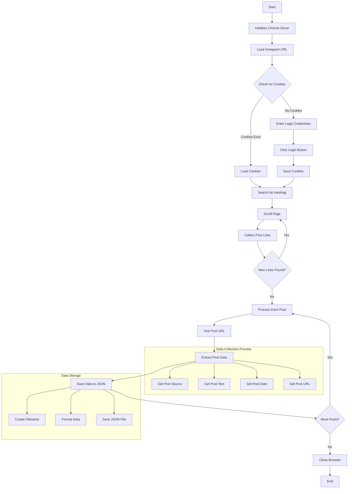

# Instagram Data Collection Bot

This is an automated bot that collects data from Instagram posts based on specific hashtags. The bot uses Selenium WebDriver to interact with Instagram's web interface and collects various information from posts including source, post text, date, and URL.

## Features

- Automated Instagram login with cookie management
- Hashtag-based post search
- Data collection from multiple posts including:
  - Post source (username)
  - Post text content
  - Post date and time
  - Post URL
- Automatic data saving in JSON format
- Cookie management for persistent sessions

## Workflow



## Prerequisites

- Python 3.x
- Chrome browser installed
- ChromeDriver (compatible with your Chrome version)

## Installation

1. Clone this repository:
```bash
git clone <repository-url>
cd Instagram_BOT
```

2. Install the required dependencies:
```bash
pip install selenium
```

3. Make sure you have ChromeDriver installed and in your system PATH.

## Configuration

Before running the bot, you need to set up your Instagram credentials in `app.py`:
```python
username.send_keys("your_username")
password.send_keys("your_password")
```

You can also modify the search keyword by changing the `keyword` variable:
```python
keyword = "YourSearchKeyword"
```

## Usage

1. Run the bot:
```bash
python app.py
```

2. The bot will:
   - Log in to Instagram (or use saved cookies)
   - Search for posts with the specified hashtag
   - Collect data from the posts
   - Save the data in JSON files

## Data Storage

The bot saves collected data in JSON files, with each post's data stored in a separate file. The filename is derived from the post URL.

## Security Note

- Never commit your actual Instagram credentials to the repository
- Consider using environment variables for sensitive information
- The bot includes cookie management to avoid frequent logins

## Limitations

- The bot is subject to Instagram's rate limits
- Instagram's website structure changes may require updates to the code
- The bot may need adjustments if Instagram updates their interface

## Contributing

Feel free to submit issues and enhancement requests.

## License

This project is licensed under the MIT License - see the LICENSE file for details. 